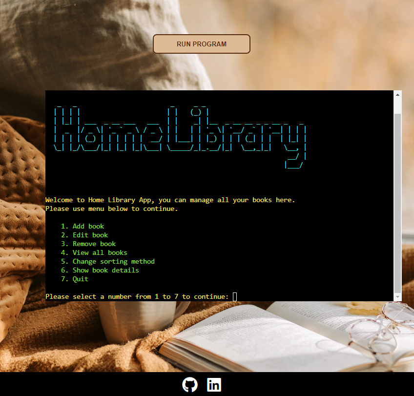
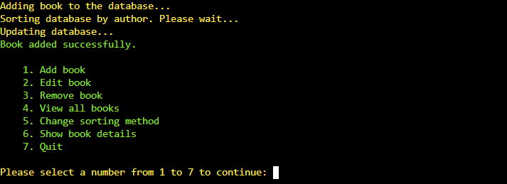
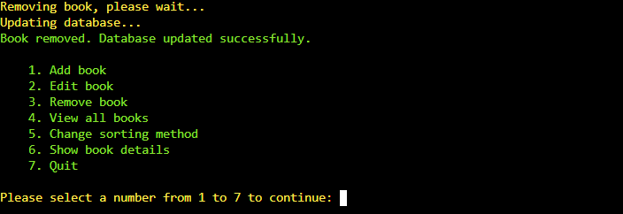

<h1 align="center">Home Library App - Python Project</h1>

### Developer: Aleksander Kisielewicz

<b>[View live program here](https://home-library-app-ci.herokuapp.com/)</b> :computer:

The Home Library App was created as Portfolio Project #3 (Python Essentials) for Diploma in Full Stack Software Development at [Code Institute](https://www.codeinstitute.net). It allows users to manage their personal book libraries, view, add, edit, and remove books.

Project purpose was to build a command-line python application that allows user to manage a common dataset about a particular domain.

# Table of content

*   [Project](#project)
    *   [Strategy/Scope](#strategyscope)
    *   [Site owner goals](#site-owner-goals)
    *   [External user's goal](#external-users-goal)
*   [User Experience (UX/UI)](#user-experience-ux)
    *   [Colour Scheme](#colour-scheme)
*   [Logic and features](#logic-and-features)
    *   [Python logic](#python-logic)
    *   [Database structure](#database-structure)
    *   [Features](#features)
*   [Technology](#technology)
    *   [Software used](#software-used)
    *   [Python libraries/modules](#python-librariesmodules)
*   [Testing](#testing)
    *   [Accessibility](#accessibility)
    *   [Validation](#validation)
*   [Deployment](#deployment)
*   [Credits](#credits)
    *   [Code](#code)
    *   [Media](#media)
    *   [Acknowledgements](#acknowledgements)

#   Project
##  Strategy/Scope

I chose to develop an application that can be used in real life. Home Library allows users to manage their personal book libraries. Application contains such functionalities as: viewing book database, adding/editing and removing books. User can display details of every database entry and also sort database in chosen order.

Application should have clean and intuitive user interface and offer easy access and navigation to all functionalities.

To achieve the strategy goals I implemented following features:

- clean user interface for easy navigation and readability
- menu with easy acces to all features and possibility to exit program
- colours in terminal to give user feedback depends on his actions
- reliable and quick connection with database provided by Google
- customised terminal display page for better visual experience

## Site owner goals

As a program owner/developer I would like to:
- create application that has real life usage 
- create application that is easy to use and intuitive to navigate
- create application with clean, good looking and accesible interface
- provide user a feedback to every input and action
- decide what kind of user input is allowed and valid
- create bugs free application

##  External user's goal

As a user I would like to:
- be able to clearly understand application's purpose
- be able to use program with real usability
- be able to easily navigate the program and access all features
- be able to receive feedback to actions taken
- be able to decide what to do next, what features to use
- be able to quit program at all stages
- avoid any errors/bugs

#   User Experience (UX)
##  Colour Scheme

Colour palette was selected using <b>coolors.co</b> generator and has been extracted from the backgroud picture used in terminal view HTML page. Colour of the "run program" button was adjusted to match the backgroud.

Terminal outputs are displayed in high-contrast colours over black background for better readability and accesibillity. Standard prompts are yellow, book addition and edit inputs are blue, warnings red. Confirmation messages and menus are green. Bigger chunks of data coming from the database are printed in standard white colour to be non-distractive.

Screenshots presenting terminal and colour outputs are available in [Features](#features) section.

Starting screen of the app with logo and menu:

# Logic and features

## Python Logic

A flow diagram of the logic behind the application was created using [Lucid Chart](https://www.lucidchart.com/).

For PDF version [click here](docs/flow_diagram.pdf)

## Database structure

Google Sheets service is used to store project's database in the spreadsheet. There are two worksheets, one to store book entries and second to store information about sorting method.

Worksheet "library" is used to store book entries:

Main table consists of six colums: ID, title, author, category, status and description.

Each column has individually assigned value that represents maximum string length that can be input by user. It's 2, 24, 18, 12, 8 and 200 characters respectively. Exceeding that limit results in error and feedback sent to the user. This limitation is necessary to correctly display the table in the terminal which maximum length is 80 characters.  

Worksheet "config" is used to store values for default and optional sorting method:

## Features

### Main menu

Start screen of the application consists of logo, welcome message and main menu with 7 options. User input is validated.

### Add book

This feature allows user to add new entry to the library. Following details can be added: title, author, category, reading status and description. The ID number is generated for new book automaticaly.  

If database is empty, user is asked to add his first book in order to be able to use other app features.  

There is additional feature implemented here. It checks if title string contains prefix "the". It converts the string to format "Title, The" and shows user converted title.

Every input is validated, it should be at least 3 characters long.

Each book detail has individually set maximum length. Max. title length it's 24 characters.

Input can't be empty.

Title can't start with special character.

User is asked to chose reading status of the book by pressing "1" or "2".

This field is validated.

Upon successfull entry of all details user is asked to confirm book addition.

User receives confirmation when book is added.
Automatic sorting of the database is applied and all book's are renumbered with ID. The purpose of this operation is to keep ascending numerical order in the database when book is added or removed. ID number in this case is used only as record's ordinal number. I realise that in more complicated database each entry would be assigned to unique, fix number but in my application sorting by title or by author is more useful.

### Edit book

This function allows user to edit every book's detail. First, user is asked to choose book to edit and when book's detailed view is presented, user can choose what detail he wants to edit. It is also possible to return to main menu. The input is validated. 

The function works in a similar way as add book function, but it updates exisiting entries.

Also here application check title if prefix "the" was entered. In this case it converts the string to format "Title, The".

User receives confirmation and updated values are shown in the table.

### Remove book

This function allows user to delete selected book from the database. User is asked to select book to delete and then need to confirm his choice. The input is validated.

The status of the book is checked and printed in the terminal. Green message is printed if book's status is READ and red message if NOT READ. The input is validated.

Confirmation is shown when book is deleted.

### View all books

This function allows user to view all database records. The table max. width is limited to 79 characters to comply with PEB8 and match the terminal mockup.

### Change sorting method

This user allows user to chose database sorting method. Books are always sorted in alphabetical, ascending order but user can chose column to sort by - by title or by author.  
Config worksheet stores values for both default and optional method. User can choose method opposite to currently set. The ID values are automatically renumbered in order to keep ascending order. I used this logic in order to avoid need to sort database each time when program starts or ends. It would take time to load application and there is no guarantee that user properly terminate the application. Default and optional method values are updated in config worksheet each time sorting is done. User can also decide to go back to previous screen. Input is validated.

Confirmation is printed in the terminal when operation is finished.

### Show book details

This function allows user to view all details of the selected book.

Description maximym length is limited to 200 characters, that's why it's displayed under the table. The text is wrapped to 79 characters in line. The input is validated.

### Quit

This function terminates the program. User is asked to confirm his choice, the input is validated. Application generates and displays random literature-related quote.  

Exit screen is displayed when user confirms exit. It contains the credits, social media links and another feature which is next read suggestion. It works only if in database is at least one book with status "NOT READ".

#   Technology
    
##  Languages used

-   [Python](https://www.python.org/) - high-level, general-purpose programming language.
-   [Markdown](https://en.wikipedia.org/wiki/Markdown) - markup language used to write README document.

##  Software used

- [Coolors.co](https://coolors.co/) - was used to create colour palette for terminal display page.

- [Font Awesome:](https://fontawesome.com/) - Font Awesome icons were used for social links in terminal display page.

- [Git](https://git-scm.com/) - Git was used for version control by utilizing the Gitpod terminal to commit to Git and Push to GitHub.

- [GitHub](https://github.com/) - GitHub is used to store the project's code after being pushed from Git.

- [Google Sheets API](https://developers.google.com/sheets/api) - was used to connect with the database made of the spreadsheet.

- [Favicon.io](https://www.favicon.io) - tool used to create favicon.

- [LucidChart](https://www.lucidchart.com/pages) - was used to create flow diagram.

- [Pexels.com](https://www.pexels.com/) - was used to source bacground picture for terminal display page.

- [PyCharm](https://www.jetbrains.com/pycharm/) - Python IDE used to write the app.

- [Text ASCII Art Generator](http://patorjk.com/software/taag/) - used to create app logo in ASCII format.

##  Python libraries/modules

- [gspread](https://docs.gspread.org/) - used for control Google Sheets API by python.

- [OAuthLib](https://pypi.org/project/oauthlib/) - required to manage HTTP request and authenticate to Google Sheets API.

- [PrettyTable](https://pypi.org/project/prettytable/) - python library for easily displaying tabular data in a visually appealing ASCII table format.

- [colorama](https://pypi.org/project/colorama/) - used to color terminal outputs.

- [os](https://docs.python.org/3/library/os.html) - built-in pythod module - used to write clear_terminal function.

- [textwrap](https://docs.python.org/3/library/textwrap.html) - built-in python module - used to wrap lines over 79 char to next line e.g. long book description.

- [random](https://docs.python.org/3/library/random.html) - built-in python module - used to generate random quote and random book on exit screen.

#    Testing

##   Accessibility

## Validation

### PEB8

##   Bugs/known issues

- <b>Issue #1:</b> During the edit I made indentation error and misplaced last "break" instruction of the code presented on screenshot below. That caused infinite loop to work in the backgroud without any terminal output. It was a major issue as all main program features generated an Google Sheets API error code 429 - "To many requests HTTP status code response". I thought that I exceeded Google Sheets Quoata per user/per minute/per project but after checking logs and quotas in Google Cloud Console I knew that something else caused an error. I finally managed to find the mistake. It wasn't obvious as function was meant to work "in the bacground" without any terminal output as long as there are records in database. Database wasn't ampty at that time so the message hasn't been shown.

<b>Solution:</b> Putting "break" instruction in the correct place, that allows to quit the while loop. 

#   Deployment

PLACEHOLDER

 

#   Credits

##  Code

- Google Sheets API connection method is taken from Love Sandwiches CI Project and gspread documentation - in /api/google_sheets_api.py - [line 10-19](https://github.com/alexkisielewicz/home-library-app/blob/dac2a1c42d48e5b81d5fb6c0788b1f3f116317d2/api/google_sheets_api.py#L10)
- [Stack Overflow](https://stackoverflow.com/questions/2084508/clear-terminal-in-python) - method used to write clear_terminal function in /utils/utils.py - [line 26-32](https://github.com/alexkisielewicz/home-library-app/blob/dac2a1c42d48e5b81d5fb6c0788b1f3f116317d2/utils/utils.py#L26)

##  Media

- [Goodreads.com](https://www.goodreads.com/) - the source of the quotes used on app exit screen.
- [Pexels.com](https://www.pexels.com) - the source of the terminal page background picture.
- [Text ASCII Art Generator](http://patorjk.com/software/taag/) - used to create app logo in ASCII format. 

## Learning resources

- [Code Institute course and learning platform](https://codeinstitute.net/)
- [The book "Python Crash Course, 2nd Edition: A Hands-On, Project-Based Introduction To Programming"](https://nostarch.com/pythoncrashcourse2e)
- [StackOverflow](https://stackoverflow.com/)
- [W3Schools](https://www.w3schools.com/python/default.asp)
- [Google Sheets API documentation](https://developers.google.com/sheets/api/quickstart/python)
- [Gspread documentation](https://docs.gspread.org/en/v5.7.0/)

##  Acknowledgements

-   My Mentor Reuben Ferrante for helpful feedback and guidance at all stages of the project. 
-   Code Institute Slack Community for being invaluable knowledge base.

## Disclaimer
-   Home Library app was created for educational purpose only. 